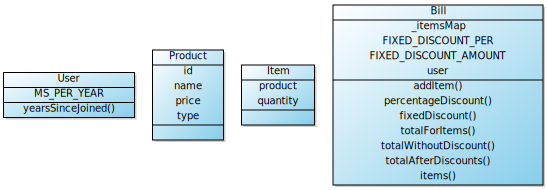

# A Simple Bill project


### Usage Guide

To use this this project you need to have node installed with yarn.


To run the tests use the following command.
```
yarn test
```

To view the code coverage.
```
yarn coverage
```

To generate the class UML
```
yarn uml
```


To run the Linting tool use
```
yarn lint
```

#### Class Diagram
